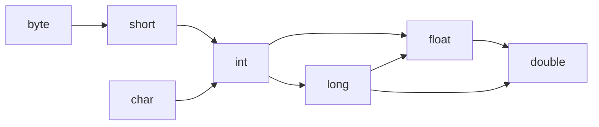

[toc]

# 第三章 Java的基本程序数据结构

## 3.1一个简单的Java应用程序

```java
public class TestSample {
    public static void main(String[] args) {
        System.out.println("We will not use 'Hello,World!");
    }
}

Java区分大小写
关键字public称为访问修饰符（access modifier）,这些修饰符用于控制程序的其他部分对这段代码的访问级别
关键字class表明Java程序中的全部内容都包含在类中。这里，只需要将类作为一个加载程序逻辑的容器，程序逻辑定义了应用程序的行为。

```

## 3.2注释

```java
// 单行注释
/*
*
*/	多行
```

## 3.3数据类型

Java是一种强类型语言。每一个变量必须声明一种类型。
8种基本类型（primitive type),4种整形，2种浮点类型，1种用于表示Unicode编码的字符单元的字符类型char和1种用于表示真值得boolean类型。

### 整型

Java整型
|类型|存储需求|取值范围|
|---|---|---|
|int|4字节|-2 147 483 648 ~ 2 147 483 647（正好超过20亿）|
|short|2字节|-32 768 ~ 32 767|
|long|8字节|-9 223 372 036 854 775 808 ~ 9 223 372 036 854 775 807|
|byte|1字节|-128 ~ -127|

### 浮点类型

|类型|存储需求|取值范围|
|---|---|---|
|float|4字节|大约±3.402 823 47E+38F(有效位数为6 ~ 7位)|
|double|8字节|大约±1.797 693 134 862 315 70E+308（有效位数为15位）|
 double表示的数值精度是float类型的两倍（有人称之为双精度数值）

### char类型

特殊字符的转义序列
|转义序列|名称|Unicode值|
|:---:|:---:|:---:|
|\b|退格|\u0008|
|\t|制表|\u0009|
|\n|换行|\u000a|
|\r|回车|\u000d|
|\"|双引号|\u0022|
|\'|单引号|\u0027|
|\\|反斜杠|\u005c|

### Unicode 和 char类型

对于任意给定的代码值，在不同的编码方案下有可能对应不同的字母；二是采用大字符集的语言其编码长度有可能不同。
设计Unicode编码的目的就是要解决这些问题。
在Java中，char 类型描述了UTF-16编码中的一个代码单元。
我们强烈建议不要在程序中使用char类型，除非确实需要处理UTF-16代码单元。最好将字符串作为抽象数据类型处理。

### boolean类型

boolean(布尔)类型有两个值:false和true,用来判定逻辑条件.整型值和布尔值之间不能进行相互转换.

### 变量

在Java中,每个变量都有一个类型(type).在声明变量时,变量的类型位于变量名之前.

```java
double salary;
int vacationDays;
由于声明是一条完整的Java语句,所以必须以分号结束.变量中所有的字符都是有意义的,并且大小写敏感.变量名的长度基本上没有限制.
不能用Java保留字作为变量名,可以在一行中声明多个变量:
int i,j; //both are integers
不过,不提倡使用这种风格.逐一声明每一个变量可以提高程序的可读性
```

### 变量初始化

```java
生命一个变量之后,必须用赋值语句对变量进行显式初始化,千万不要使用未初始化的变量.
例如,Java编译器认为下面的语句序列是错误的:
int vacationDays;
System.out.println(vacationDays); //Error--cariable not intiallized
对已经声明过的变量进行赋值,需要将变量名放在等号(=)左侧,相应取值的Java表达式放在等号的右侧.
int vacationDays;
vacationDays = 12;

也可以将变量的声明和初始化放在同一行中.例如:
int vacationDays =12;

最后,再Java中可以将声明放在代码中的任何地方.例如,下列代码的书写形式在Java中是完全合法的:
double salary = 65000.0;
System.out.println(salary);
int vacationDays = 12; //OK to declare a variable here

在Java中,变量的声明尽可能地靠近变量第一次使用的地方,这是一种良好的程序编写风格
```

### 常量

```java
在Java中,利用关键字final指示常量.例如:

public class Constants {
    public static void main(String[] args) {
        final double CM_PER_INCH =2.54;
        double paperWidth = 8.5;
        double paperHeight =11;
        System.out.println("Paper size in centimeters:"
        +paperWidth * CM_PER_INCH + "by" +paperHeight*CM_PER_INCH);
    }
}

关键字final表示这个变量只能被赋值一次.习惯上,常量名使用全大写.

在Java中,经常希望某个常量可以在一个类中的多个方法中使用,通常将这些常量称为类常量.可以使用关键字static final 设置一个类常量.下面是使用类常量的示例:
public class Constants2 {
    public static final double CM_PER_INCH=2.54;
    public static void main(String[] args) {
        double paperWidth =8.5;
        double paperHeight=11;
        System.out.println("Paper size in centimeters:"
        + paperWidth * CM_PER_INCH+"by" + paperHeight* CM_PER_INCH);
    }
}

需要注意,类常量的定义位于main方法的外部.因此,在同一个类的其他方法中也可以使用这个厂两.而且,如果一个常量被声明为public.那么其他类的方法也可以使用这个常量.在这个市里中,Constants2.CM_PER-INCH就是这样一个常量.
```

### 运算符

```java
在Java中,使用算数运算符+,-,*,/表示加减乘除运算.当参与/运算的两个操作数都是整数时,表示整数除法;否则,表示浮点除法.整数的求余操作(有时称为取模)用%表示.例如,15/2等于7,15%2等于1,15.0/2等于7.5.
需要注意,整数被0除将会产生一个异常,而浮点数被0除将会得到无穷大或NaN结果
```

### 数学函数与常量

```java
在Math类中，包含了各种各样的数学函数。在编写不同类别的程序时，可能需要的函数也不同。
要想计算一个数值的平方根，可以使用sqrt方法：
double x =4;
fouble y=Math.sqrt(x);
System.out.printLn(y);//prints 2.0

在Java中，没有幂运算，因此需要借助于Math类的pow方法。语句：
double y =Math.pow(x,a);

将y的值设置为x的a次幂（xa）。pow方法有两个double类型的参数，其返回结果也为double类型。
floorMod方法的目的是解决一个长期存在的有关整数余数的问题。考虑表达式n%2。
如果n是偶数，这个表达式为0；如果n是奇数，表达式则为1.当然，除非n是负数，如果n为负，这个表达式则为-1.
设计最早的计算机时，必须有人指定规则，明确整数除法和求余对负数操作数该如何处理。数学家们几百年来都知道这样一个最优（或“欧几里德”）规则：余数总是要≥0.不过，最早制定规则的人并没有翻开数学书好好研究，而是提出了一些看似合理但实际上很不方便的规则。

下面考虑这样一个问题：计算一个时钟时针的位置。这里要做一个时间调整，而且要归一化为一个0~11之间的数。这很简单：（position+adjustment）%12.不过，如果这个调整为负会怎么样呢？你可能会得到一个负数。所以要引入一个分支，或者使用（（position + adjustment）%12+12）%12.不管怎样，总之都很麻烦。

floorMod方法就让这个问题变得容易了：floorMod（position + adjustment,12)总会得到一个0~11之间的数。（遗憾的是，对于负除数，floorMod会得到负数结果，不过这种情况在实际中很少出现。）
​```java
 Math类提供了一些常用的三角函数：
 Math.sin
Math.cos
Math.tan
Math.atan
Math.atan2
还有指数函数以及它的反函数——自然对数以及以10为底的对数：
Math.exp
Math.log
Math.log10
最后，Java还提供了两个用于表示π和e常量的近似值：
Math.PI
Math.E
不比在数学方法名和常量名前添加前缀“Math”，只要在源文件的顶部加上下面这行代码就可以了。
import static java.lang.Math.*;
例如：
System.out.println("The square root of \u03c0 is" +sqrt(PI));

在Math类中，为了达到最快的性能，所有的方法都使用计算机浮点单元中的例程。如果得到一个完全可预测的结果比运行速度更重要的话，那么久应该使用StrictMath类。它使用“自由发布的Math库”（fdlibm）实现算法，以确保在所有平台上得到相同的结果。
```

### 数值类型之间的转换

```java
经常需要一种数值类型转换为另一种数值类型。
图中有6个是新剪头，表示无信息丢失的转换；有3个虚箭头，表示有精度损失的转换。例如，123 456 789是一个大整数，它所包含的位数比float类型所能够表达的位数多。当将这个整型数值转换为float类型时，将会得到同样大小的结果，但却失去了一定的精度。

int n = 123456789;
float f =n; //f is 1.23456792E8

当使用上面两个数值进行二元操作时（例如n+f，n是整数，f是浮点数），先要将两个操作数转换为同一种类型，然后再进行计算。
- 如果两个操作数中有一个是double类型，另一个操作数就会转换为double类型。
- 否则，如果其中一个操作数是float类型，另一个操作数将会转换为float类型。
- 否则，如果其中一个操作数是long类型，另一个操作数将会转换为long类型。
- 否则，两个操作数都将被转换为Int类型。
```



### 强制类型转换

```java
必要时，int类型的值回自动的转换为double类型。但另一方面，有时也需要将double装换成int。在Java中，允许进行这种数值之间的类型转换。
当然，有可能会丢失一些信息。在这种情况下，需要通过强制类型转换（cast）实现这个操作。强制类型转换的语法格式是在圆括号中给出想要转换的目标了嘻，面紧跟待转换的变量名。例如：
double x =9.997;
int nx = (int)Math.round(x);
现在，变量nx的值为10.当调用round的时候，仍然需要使用强制类型转换（int）。其原因是rount方法返回的结果为long类型，由于存在信息丢失的可能性，所只有使用显式的强制类型转换才能够将long类型转换成int类型。
```

### 结合赋值和运算符

```java
x+=4;
等价于：
x=x+4;
(运算符放在=号左边，如*=或%=)
如果运算符得到一个值，其类型与左侧操作数的类型不同，就会发生强制类型转换：
x+=3.5; //x设置为(int)(x+3.5)
```

### 自增与自减运算符

```java
int m = 7;
int n =7;
int a =2*++m; //now a is 16, m is 8
int b =2* n++; //now b is 14,n is 8
仅以不要在表达式中使用++，因为这样的代码很容易让人困惑，而且会带来烦人的bug。
### 关系和boolean运算符
3==7 false
3！=7 true
x < y ? x:y  返回x和y中较小的一个
### 位运算符
可以直接对组成整型数值的各个位完成操作。
位运算符包括：
&("and") | ("or") ^("xor") ~ ("not")
>>和<<运算符将位模式左移或右移。西药建立位模式来完成位掩码时，这两个运算符会很方便：
int fourthBitFromRight = (n & (1 << 3)) >> 3;
>>>运算符会用0填充高位，这与>>不同，它会用符号位填充高位，不存在<<<运算符。
```

### 括号与运算符级别

同一个级别的运算符按照从左到右的次序进行计算（除了右结合运算符外。）
由于&&的优先级比||的优先级高，所以表达式
a &&b || c 等价于(a && b) || c
又因为+=是右结合运算符，所以表达式
a += b += c 等价于 a += (b+=c)

运算符优先级
|运算符|存结合性|
|:-:|:-:|
|[].()(方法调用)|从左向右|
|! ~ ++ -- +(一元运算)（）（强制类型转换）new|从右向左|
|*/%|从左向右|
|+ -| 从左向右|
|<< >> >>>|从左向右|
|< <= > >= instanceof| 从左向右|
|= = ！=| 从左向右|
|&|从左向右|
|^|从左向右|
|||从左向右|
|&&|从左向右|
||||从左向右|
|？：|从右向左|
|=  +=  -=  *=  /=  %=  &=  \|=  ^=  <<=  >>=  >>>=|从右向左|

### 枚举类型

变量的取值在一个有限的集合内。例如：销售的服装或比萨饼只有小、中、大和超大这四种尺寸。针对这种情况，可以自定义枚举类型。枚举类型包括有限个命名的值。例如

```java
enum Size { SMALL,MEDIUM,LARGE,EXTRA_LARGE };
可以声明这种类型的变量：
Size s =size .MEDIUM;
Size类型的变量只能存储这个类型声明中给定的某个枚举值，或者null值，null表示这个变量没有设置任何值。
```

## 字符串
Java字符串就是Unicode字符序列。串“Java\u2122”由5个Unicode字符J、a、v、a和。Java没有内置的字符串类型，而是在标准Java类库中提供了一个预定义类，很自然的叫做String。
每个用双引号括起来的字符串都是String类的一个实例：

```java
String e ="";//an empty string
String greeting = "Hello";
```

### 子串
String 类的substring方法可以从一个较大的字符串提取出一个子串。例如:

```java
String greeting = "Hello";
String s = greeting.substring(0,3);
```

创建了一个由字符“Hel”组成的字符串。
substring的工作方式有一个优点：容易计算子串的长度。字符串s.substring(a,b)的长度为b-a.例如，子串“Hel”的长度为3-0=3

### 拼接

```java
String expletive = "Expletive";
        String PG13 = "deleted";
        String message = expletive+PG13;
        /*上述代码将“Expletivedeleted”赋给变量message（注意，单词之间没有空格， +号
        按照给定的次序将两个字符串拼接起来。
        当将一个字符串与一个非字符串的值进行拼接时，后者被抓换成字符串（在第5章可以看到，
        任何一个Java 对象都可以转换成字符串）

         */
        int age = 13;
        String rating = "PG"+age;
        //这种特性通常用在输出语句中。
        System.out.println("The answer is"+rating);
        //这是一条合法的语句，并且将会打印出所希望的结果(因为单词is后面加了一个空格，输出时也会加上这个空格）
        //如果需要把多个字符串放在一起，用一个定界符分割，可以使用静态join方法：
        String all =String.join(" /","S","M","L","XL");
        //all is the String"S/M/L/XL"
```

### 3.6.3 不可变字符串
String类没有提供用于修改字符串的方法。

```java
greeting = greeting.substring(0,3) + "p!";
```
由于不能修改Java字符串中的字符，所以在Java文档中将String类对象成为不可变字符串，如同数字3永远是数字3一样，字符串“Hello”永远包含字符H、e、l、l和o的代码单元序列，而不能修改其中的任何一个字符。可以修改字符串变量greeting，让它饮用另外一个字符串，这就如同可以将存放3的数值变量改成存放4一样。
    不可变字符串有一个优点：编译器可以让字符串共享。
为了弄清具体的工作方式，可以想象将各种字符串存放在公共的存储池中。字符串变量指向存储池中相应的位置。如果复制一个字符串变量，原始字符串与复制的字符串共享相同的字符。
    Java的设计者认为共享带来的高效率远远胜过于提取、拼接字符串所带来的低效率。查看一下程序会发现：很少需要修改字符串，而是往往需要对字符串进行比较
### 3.6.4检测字符串是否相等
可以使用equals方法检测两个字符串是否相等。对于表达式：
s.equals(t)	
如果字符串s与字符串t想等，则返回true；否则，返回false。需要注意，s与t可以是字符串变量，也可以是字符串字面两。例如，下列表达式是合法的：
    "Hello".equals(greeting)
    要想检测两个字符串是否相等，而不区分大小写，可以使用equalsIgnoreCase方法。
    "Hello".equalsIgnoreCase("hello")
    一定不要使用==运算符检测两个字符串是否相等！这个运算符只能够确定两个字符串是否放置在同一个位置上。当然，如果字符串放置在同一个位置上，它们必然相等。但是，完全有可能将内容相同的多个字符串的拷贝放置在不同的位置上。
    如果虚拟机始终将相同的字符串共享，就可以使用==运算符检测是否相等。但实际上只有字符串常量是共享的，而+或substring等操作产生的结果并不是共享的。因此，千万不要使用==运算符测试字符串的相等性，一面在程序中出现糟糕的bug。从表面上看，zhezhongbug很像随机产生的间歇性错误。
#### 3.6.5 空值与Null串
空串""是长度为0的字符串。可以调用以下代码检查一个字符串是否为空:
if(str.length() ==0)
或
if(str.equals(""))
    空串是一个Java对象，有自己的串长度（0）和内容（空）。String变量还可以存放一个特殊的值，名为null，这表示目前没有任何对象与该变量关联。要检查一个字符串是否为null，要使用以下条件：
    if(str == null)
    有时要检查一个字符串既不是null也不为空串，这种情况下就需要使用以下条件：
    if(str != null && str.length() != 0)
    首先要检查str不为null。
#### 3.6.6码点与代码单元
    Java字符串由char值序列组成。从3.3.3节“char类型”已经看到，char数据类型是一个采用UTF-16编码表示Unicode码点的代码单元。大多数的常用Unicode 字符使用一个代码单元就可以表示，而辅助字符需要一对代码单元表示。例如：
```java
String greeting = "Hello";
        int n = greeting.length();//is 5
        //要想得到实际的长度，即码点数量，可以调用：
        int cpCount = greeting.codePointCount(0,greeting.length());
        //调用s.charAt(n)将返回位置n的代码单元，n介于0 ~ s.length()-1之间。例如：
        char first = greeting.charAt(0);// first is 'H'
        char last = greeting.charAt(4);// last is 'o'
        //要想得到第i个码点，应该使用下列语句
        int index = greeting.offsetByCodePoints(0,1);
        int cp = greeting.codePointAt(index);
```
#### String API
Java中的String类包含了50多个方法。令人惊讶的是绝大多数都很有用，可以设想使用的频率非常高。下面的API注释汇总了一部分最常用的方法。


#### 3.6.8 阅读联机API文档
String类包含许多方法，而且，在标准库中有几千个类，方法数量更加惊人，要想记住所有的类和方法是一件不太可能的事情。因此，学会使用在线API文档十分重要，从中可以查阅到标准类库中的所有类和方法。

#### 3.6.9 构件字符串
由较短的字符串构建字符串，例如，按键或来自文件中的单词。采用字符串连接的方式达到此目的的效率比较低。每次连接字符串，都会构建一个新的String对象，既耗时，又浪费空间。使用StringBuilder类就可以避免这个问题的发生。

```java
public static void main(String[] args) {
        StringBuilder builder = new StringBuilder();
        //当每次需要添加一部分内容时，就调用append方法。
        builder.append(ch);
        builder.append(str);
        //在需要构件字符串时调用toString方法，可以得到一个String对象，其中班喊了构建器中的字符序列。
        String completedString = builder.toString();
    }
```


